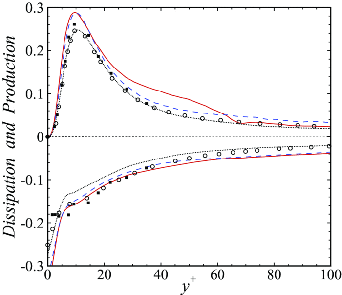

Fundamental research in turbulence is hard. It requires a good understanding of applied mathematics and a firm grasp of the physical phenomena into the dynamics of fluids. The closure problem to the Reynolds Averaged Navier-Stokes (RANS) motivated leading experts to construct models. This undertaking is called turbulence modelling. Calibration is the foundation underlying the constructions of such turbulent models. 

 

As such, the unknown double and triple correlations are replaced with algebraic expressions involving known quantities and closure coefficients. For instance, the k-w model's kinetic energy temporal derivative is calibrated to experimental obervation [see Townsend (1976)] for decaying homogeneous, isotropic turbulence.

New development in GPUs and machine/deep learning are changing the landscape for modern turbulence modelling. A new approach involves performing a limited amount of direct numerical simulation and training a neural network to predict the eddy viscosity.

The reader might already be aware, the equations are usually presented using the Einstein Covention. The turbulent kinetic energy equation is

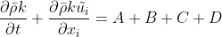

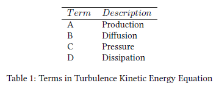

Among the unknown terms in the turbulent kinetic transport equation, the Pressure Diffusion Turbulent Diffusion are small for simple shear flows. Therefore, in the case of a turbulent channel flow, we will focus on deconstructing the <i>Production Dissipation</i> terms.

<b> Production - <i>A</i> </b>

Similarly to the <i> Reynolds decomposition </i>, The <i> Favre averaging </i> has a mean and fluctuating part. It is applied to take into accound the density change in the flow field.  

Some useful rules:

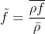

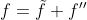

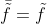

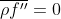

 

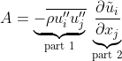

 

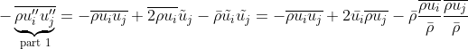

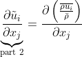

 

Apply quotient rule on the numerator:

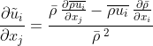

 

Apply the product rule on the first term:

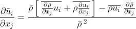

 
Finally, the production is:

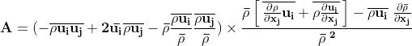

 

<b> Dissipation - <i> D </i> <b>

Firts, the laminar stress tensor must be defined and not to be confused with the mean molecular viscous stress. They use the same greek letter tau in the litterature.

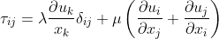

 

The equation with Einstein notation.

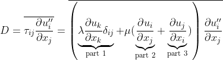

 

The final dissipation equation is:

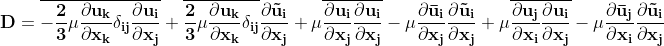

 

In the interest of keeping this short, the entire proof (similar to production) can be found on my <a href="https://github.com/DiscoBroccoli/Turbulent-Modelling-using-Machine-Learning-Techniques/blob/main/documents/Favre-Averaging.pdf"><i class="large github icon "></i>github</a> page. Notice how large the equation becomes, the code in python is included on my github page as well.

