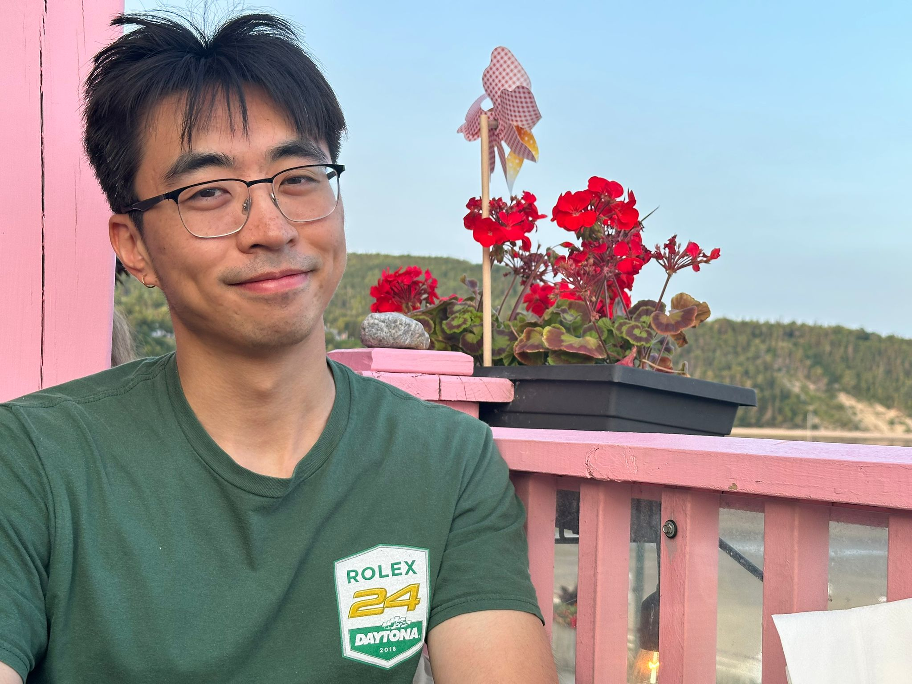

 Last week I was driving through the never ending road to Tadoussac ... I like these moments of silence and peace as I can easily reflect on myself. It feels like as if my body has been rewinding old VHS tapes of my memories. This year especially was filled with tons of new experience and writing it now seemed like a good idea. Dear friend (if it's ok to call you this way), it is with great pleasure to announce that I am no longer a corporate weapon (self given title). My path through aerodynamics, data engineering, and data science has reached its end, and I’ve chosen to take a leap I had long felt was right but never dared to commit to. An opportunity presented itself, and I seized it - carpe f diem. While those close to me have expressed concern about the risks, I see it as a calculated one. The solid foundation I built in the corporate world makes this transition into academia feel far far less worrisome. For the next six months, my focus and passion will be on differentiable rendering.

Talking about stuff that worries me. I wanted to share I have been humbled. I always been a stoic, as far as being given the title of the most chill guy in my high school year book. These iron curtains made me feel secure. To be honest I was even proud of this trait. This and my capacity to be never angry would be part of my D&D character sheet. Contributing to my wisdom and +2 modifier on saving throws from mind control (I have been playing a lot of bg3). Back to the subject, I am referring to my stress triggers. It's a low moment in my adult life... my stress limit have been put to the test. On paper it looks like I’m piling on: corporate full time job, school project, paper presentation every two weeks. Am I attracted to a busy schedule and jungling between different commitements? 

And according to my therapist. "Not quite. You're simply working toward your dream.". I felt a relief so high I wanted to laugh at myself for believing something was wrong with me.

To make it simple. There is something called locus of control. Apparently I have a strong internal locus of control paired with the conditionning of associating hard work and suffering and success. I remember from a podcast with Conan and guest Stephen Colbert sharing the same feeling. Conan:" I hate... I hate... that it fucking works". I swear if I have the chance to appear on Fan Corrections I would tell them about the difference between correlation and causation. This is such a simple thought but made quite an impact on my mental health and growth.

<!-- 

 -->

<!-- 

 -->

Looking back, I see my stoic self as a trauma response. You know, I think I feel pretty down how it affected my personal life.

Remember when I mentionned Tadoussac? Here is a pic taken from the traversier to Tadoussac. I used my new camera, Minolta Maxxum STsi. A vintage film camera from the 80s that I found in a fleece market. The image are very sharp, I love it.

 

Long coffee sip...
 
   
Here is Summer mix I listen to all the time:

- Courage, Clara Luciani - Mon pref durant les francos!
- Fly, Yoyo Sham (岑寧兒) - From the movie Better Days, I don't watch Chinese movie a lot these days and this one really touched me.
- On brûlera, Pomme - A new discovery from a friend that has this title tattooed on the right arm. 

The minimum average for a music "mix" is 2 songs. I rest my case.