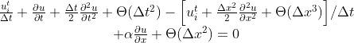

## Modified Equation Analysis on the Lax-Friedrichs Method

In the finite-difference method, our goal is to approximate a partial differential equation so that we can march the conserved variables in time. Today we'll check out the Lax-Friedrischs scheme.

Also known as the Lax scheme is a modified version of the forward in time and central in space scheme:
 

 

The result is a modified partial differential equation (PDE). Since the approximation order accuracy depends on the Taylor-Series expansion. One may ask how accurately is the scheme approximating the PDE?

You've guessed it! The modified equation analysis (MEA) measure the difference between the true PDE and our finite-difference method (FDM).

### In the context of linear advection

Using the Taylor-Series expansion until second order derivative.

 

    
 

We can now substitute (2) (3) (4) into equation (1).

 

Don't worry for the faint-hearted of crowded derivaties, here is the simplified derivative notation:

 
Notice the RHS is just extra dissipation to the original PDE. To improve interpretability, we differentiate (5) once in time and the other in space. H.O.T stands for higher order terms.

 

Using clever substitution with previous equation we may arrive at our original LHS equation. This time the RHS are all spatial derivatives. v is the Courant–Friedrichs–Lewy condition for the stability in numerical methods. It is used for a wide range of phenomena in computational fluids.

 

 

We conclude from the truncation error of the RHS that the scheme is first order accurate and is stable for v smaller or equal than 1. Furthermore, error is lead by a second derivative in space u_xx, which will induce a dominant dissipative error, when v is not 1.
