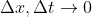
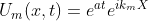
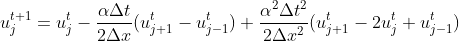
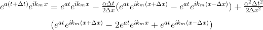
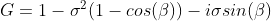
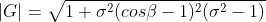
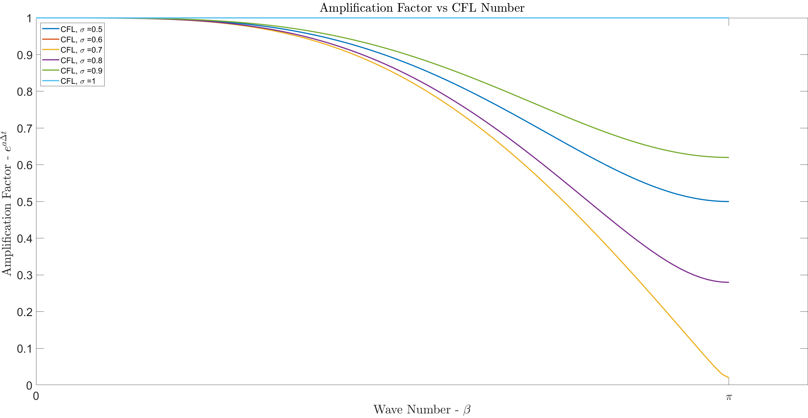
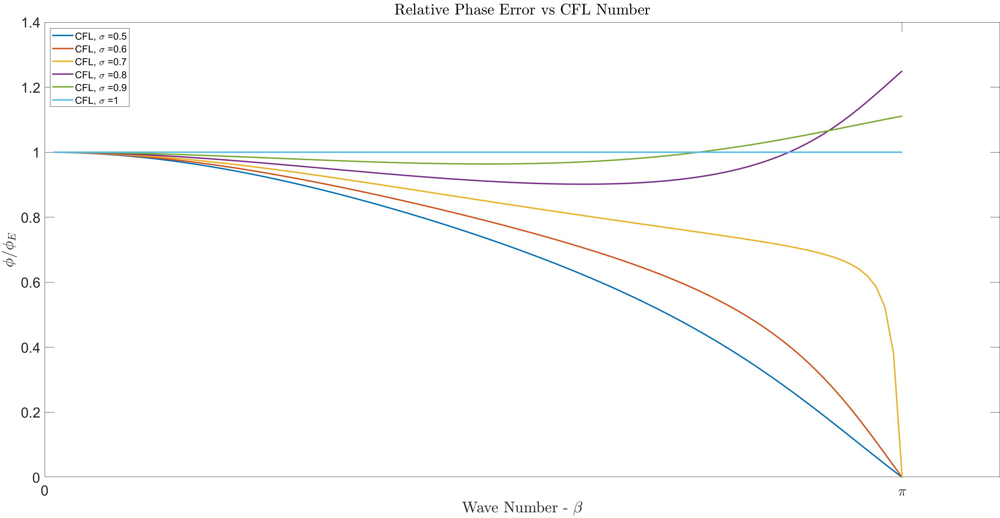
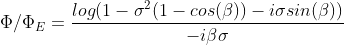

## Consistency, Stability, and Convergence

Building good numerical methods requires consistency, stability, and Convergence. The scheme is consistent if the error between the PDE and the FDM vanishes as the mesh size is refined. In other words, it recovers the exact PDE in the limit that 

Additionally, as the solution marches in time, the solution must not grow unbounded. We can assess this by expanding our solution into Fourier series.

The first term on the RHS is the amplification factor. Its decay or growth will indicate the stability of the numerical algorithm. This is known as the von Neumann stability analysis. For explicit schemes (only one unknown at next time step), the stability criteria is amplification factor must be less than 1.

The scheme of today is the Lax-Wendroff approximation for linear advection equation.

To evaluate this scheme, we will have to aplification factor equation expressed in terms of wave number.

 

Divide both side with the amplification factor then simplify with the general complex version of Euler's formula.

  
The beta symbol is the wave number and the sigma is the stability criteria. Finally, evaluate its magnitude we get:

 

  

 
The Lax Wendroff finite difference scheme recovers the exact solution when the CFL number is equal
to 1. For smaller value of CFL, the error remains bounded.

  

 
The phase error is obtained with 

We notice a lagging phase error for the Lax Wendroff scheme for CFL number 0.5, 0.6, and 0.7. How-
ever, the higher CFL numbers, excluding 1, has predominantly leading phase error for larger wave
numbers.

Similar to the amplification factor, the scheme has no phase error for CFL equal to 1.

"Given the properly posed initial value problem and a numerical scheme that is consistent, stability is the necessary and sufficient condition for convergence." <i> Lax equivalence theorem </i>
