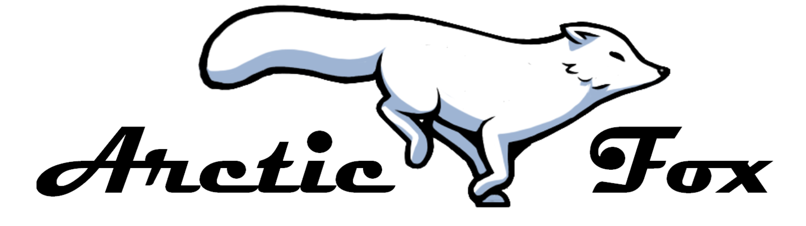

In 2019, the aerospace senior students has received a Request for Proposal (RFP) from the NSERC Chair in Aerospace Design Engineering (NCADE). The mandate is to develop a conceptual design for a new aircraft.

 

The  successful  introduction  of  UAVs  in  the  aviation  industry  depends  on  three  main efforts.  First,  technology needs to be developed to enable the safe and efficient operation of  the  vehicle  during  a  mission.   Second,  infrastructure  needs  to  be  in  place  to  allow  the operation of the vehicle.  Third, a regulatory environment and proper regulations must be implemented to allow both manned both manned and unmanned air vehicles to share common airspace.

Given that these obstacles must be resolved prior to introducing UAVs,  we have decided that the best approach to leading the fleet in Canada’s UAV market is to design an optionally-piloted cargo aircraft for deployment in Canada’s North.  The aircraft will be introduced into existing infrastructure and regulatory environments so that the safety of thetechnology can be evaluated.

  

 

## Market Analysis
Weather conditions and insufficient infrastructure in Northern Canada cause infrequentdeliveries and shortages of fresh produce as 75% of cargo transport to the region is done byair [1].  According to a 2016 - 2017 Nutrition North Canada (NNC) report, 54% of remotecommunities  lack  access  to  fresh  produce  as  defined  by  Health  Canada  [2].   In  a  bid  tomitigate this issue, the government of Canada established the NNC subsidy program.  TheNNC subsidy program is provided to suppliers and retailers that apply.  The businesses mustthen pass the full subsidies received to the consumers.  These subsidies are applied againstthe  total  cost  of  any  product  shipped  by  air  to  the  eligible  communities.   This  includescosts  that  accrue  from  “product  purchasing,  transportation,  insurance  and  overhead”  [3].The program allows food suppliers and retailers to shift a portion of the cost to the federalgovernment thereby lowering the cost to the final consumers.  According to an NNC advisoryboard report in 2014, since the program was launched, demand for fresh produce increased[4].  This, in turn, increased flight hours of cargo operators to the North.

The OEM‘s short-term profitability is sacrificed to develop a new technology that will beextended in future applications, which will then lead to long-term profit.  However, to justifythe  OEM‘s  development  and  production  costs,  the  aircraft  must  outperform  the  currentaircraft operating in the North while remaining profitable and sellable.

An analysis of the disparities in transport infrastructure between the different provincesproves that not all of the regions in Canada’s North are suitable for operation.  For instance,while communities in Yukon and Nunavut were found to have existing and growing transport infrastructure that provide year-round access by air and land, about 20 communities in theNorthwest Territories have no year-round access by land and air.  Ultimately, the Nunavikregion is a prime location to establish a hub operation as it boasts a robust transport infras-tructure as well as year-round access by water, land and air. 

## Business Case
Air transportation in the Canadian North is divided into two main business models: hub-to-hub and hub-to-point.  The hub-to-hub aircraft model strategy is to bring a bigger payload from a southern hub to a northern hub and is usually completed with large turbofan-poweredaircraft such as Boeing 737s.  The hub-to-point strategy is to redistribute smaller payloadfrom a Northern hub to a point (remote community) and is usually accomplished with ATR-42 - a medium turboprop aircraft. 

The figure below represent both North Canada air transportationmodel, starting from Montreal to Iqaluit, and then Iqaluit to remote communities.

  

Rankin Inlet, Iqaluit, Kuujjuaq, Cambridge Bay and Yellowknife are the five main North-ern hubs serving the targeted market communities.  Therefore, critical missions were estab-lished from these Northern hubs.  They serve to define Arctic Fox’s operating boundaries andlimitations in term of its critical performance and lead the aircraft sizing exercise.  Routelimitations  were  established  when  the  aircraft  is  operating  at  maximum  payload  capacitywith a lower amount of fuel needed (maximum zero fuel weight or MZFW), when operatingat maximum takeoff weight (MTOW) reaching a far community and trading payload for fuel,and when operating at maximum fuel weight and removing payload to reach the community. 

  

As  seen  in the picture above. A payload-range  diagram was then constructed  and  a maximum payload  of  10,800  lb  was  found  and  a  maximum  range  of  1170  nautical  miles.

#  PRELIMINARY DESIGN AND V&V
## Aircraft Performance

The positions and weights of components resulted in a most aft CG of 69.25%MAC from the wing leading edge when flying with maximum payload and minimum fuel,while the most forward CG is at 41.06% MAC when flying with one full pallet of cargo in themost forward position and minimum fuel. In order to avoid instability during cargo loadingand unloading, the main landing gears were positioned behind the most aft CG on ground, which was calculated to be 86.79% MAC. The range of flight CG limits falls within the longitudinal CG envelopeand the landing gear limits. 

Using knowledge from <b> AERO 446-Aerospace Vehicle Performance </b>. From the MTOW of 38,405 lb, the balanced field length (BFL) of the aircraft at sea level and standard atmosphere on a gravel runway is 2,536 feet. Furthermore, the factored landing distance (FLD) of the  aircraft  at  sea  level  and  standardatmosphere  on  a  gravel  runway  increased  to  2,357  feet.

In order to determine the balanced field length (BFL), the speeds and distances mustbe computed for the OEI takeoff and the AEO ASD and V1 must be found at which bothdistances  will  be  equal.   This  distance  is  known  as  the  BFL.  Each  case  is  separated  into multiple segments as shown figures below.

  

  

Using regulations from <b> FAR 25.105 to 115 </b>, the lift and drag of the Arctic Fox, and the acceleration equation. Each segment's is acceleration,  speed,  time  and  distance is calculated. This  enables  the  determination  of  the  the  total distance corresponding to a certain value of V1(ranging between 80% and 100% of VR).  Thedetermination of the distance for the segments between VR,VLOF and V2 was done using the OEI gradient at V2 using the equation below.

  

\\
While V2 was found using the following.

  

##  Stability - Cruise Condition
The handling qualities associated with the dynamic stability behaviour of the Arctic Foxwere  assessed  to  complement  the  stability  study  from  the  conceptual  design  phase.   The longitudinal  dynamic  stability  of  the  aircraft  was  estimated  from  [5].  This proposed approximate method relates the physical layout of the plane to its handling qualities.  In other words, the Arctic Fox‘s physical layout is translated into a state-space motion matrix which is then solved using the approximate method and a MATLAB toolset.  The latter method allows the obtention of the undamped natural frequency and the damping ratio of the Arctic Fox.  In turn, the handling qualities of the short and long periodmay be assessed.  The results are as shown below.

  

 

The two CG cases represents the top of climb and top of descent scenario of the flight.

  

## More details can be found in the report
<embed src="../downloads/Capstone-report.pdf" type="application/pdf" width="1000px%" height="1000px">

# Sources:

[1] “Canada’s  northern  food  subsidy  nutrition  north  canada:   a  comprehensive  programevaluation,” 2016. [Online]. Available:  https://www.tandfonline.com/doi/full/10.1080/22423982.2017.1279451

[2]  “2016-2017:  Full fiscal year,”  Government of Canada,  Apr. 2018. [Online]. Available:http://www.nutritionnorthcanada.gc.ca/eng/1524237277832/1524237310943

[3] “How   nutrition   north   canada   works,”   2018.   [Online].   Available:https://www.nutritionnorthcanada.gc.ca/eng/1415538638170/1415538670874

[4]  “Nutrition  north  canada  advisory  board  second  report,”  2014.  [Online].  Available:https://www.nutritionnorthcanada.gc.ca/eng/1508938932551/1508938956924

[5]   F. Stability and A. Control,Second Edition.    McGraw - Hill, 1998.

