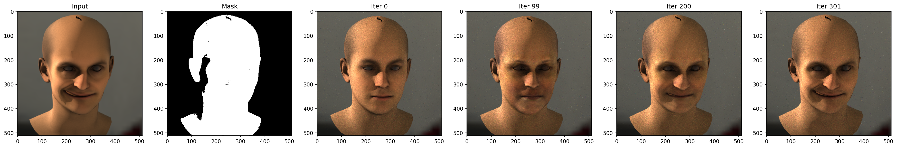
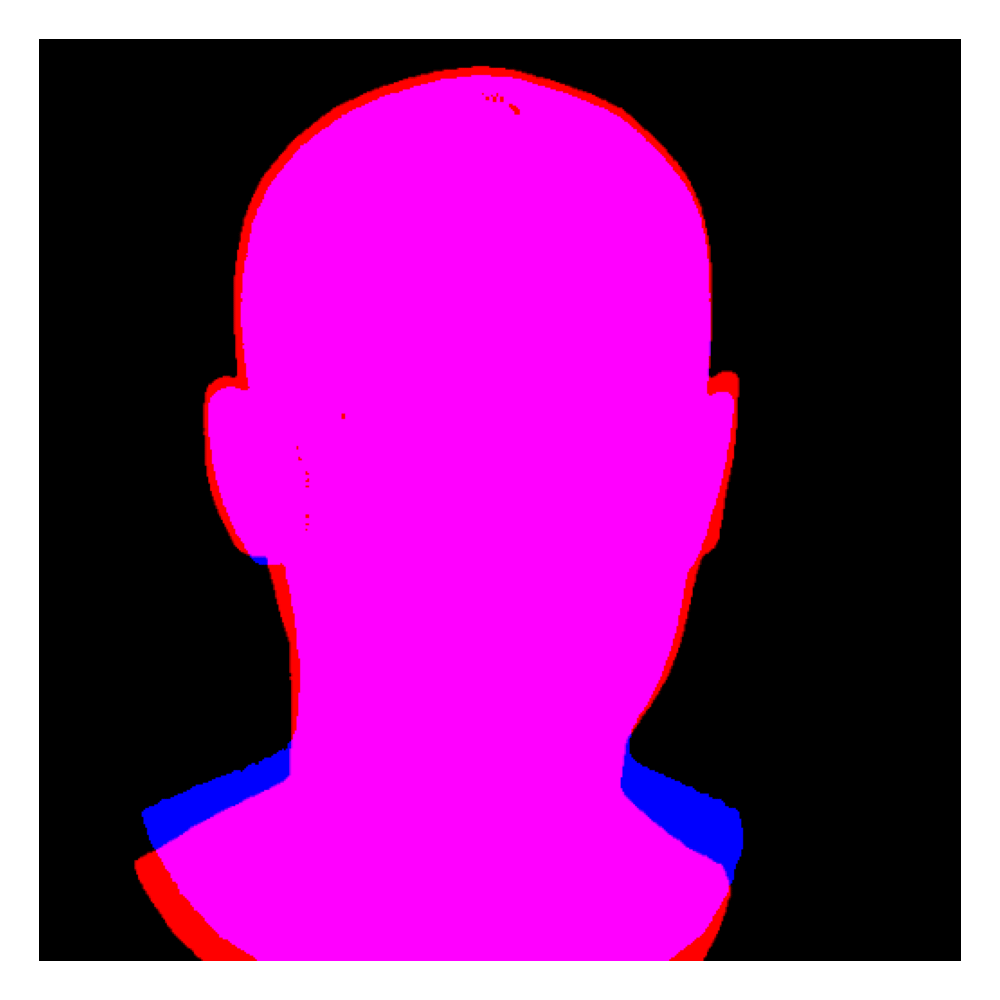
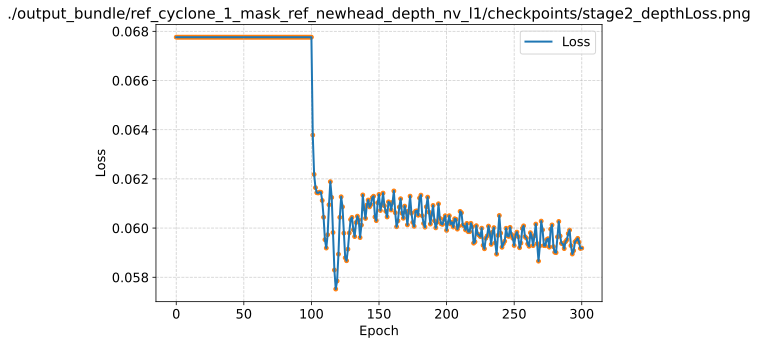
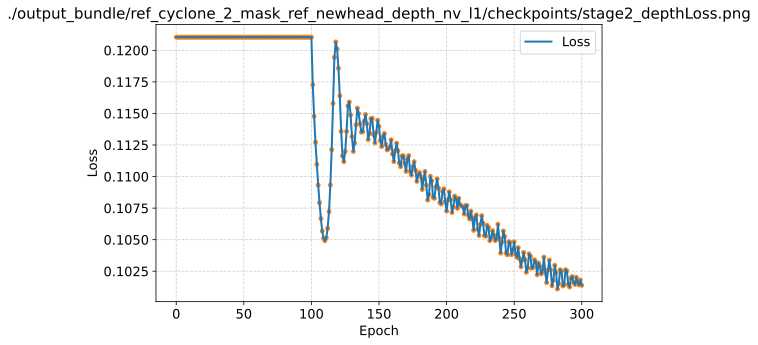
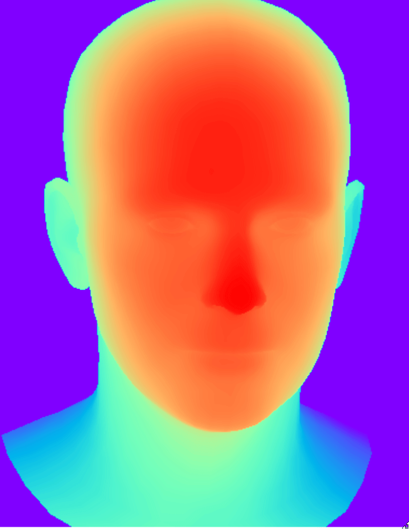
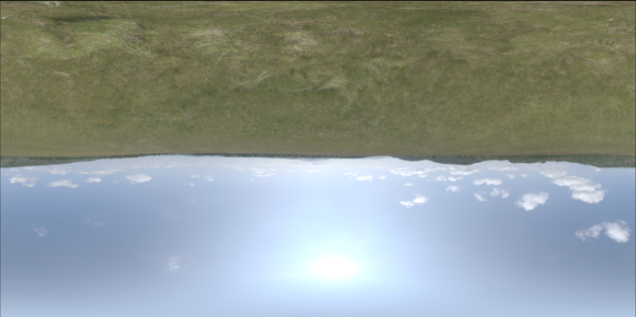
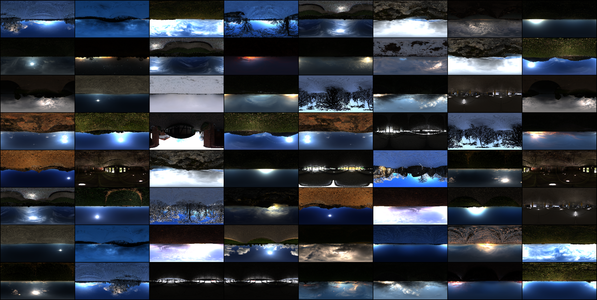
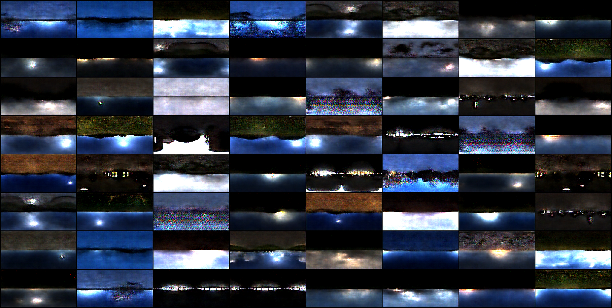

## [WORK IN PROGRESS]

## Monocular Face Reconstruction
We work with synthetically generated faces using the FLAME morphable model. Reconstructing the face using differentiable rendering with Mitsuba 3. The pipeline is fully differentiable with differentiable mask and regularizers. Below shows the face reconstruction progression from various snapshot during the optimization phase.

## Differentiable Foreground Mask
Early during the project we observed increased accuracy when we restrict the training space on the face only. We used SAM from Meta as a differentiable mask for the photo loss. 

## Depth Regularizer
We also found that incorporating depth estimation was essential when reconstructing a 3D face from a single image. Because one photo provides limited geometric cues, the optimization can drift toward incorrect shapes. Using Depth Anything as a depth prior helped anchor the reconstruction.

  
  

  
  

## Environment Map

To disentangle the skin reflectance and the light properties we used 2 approaches. Spherical Gaussian and a VAE-GAN.

  
  

Low resolution gif creates aliasing artifact.

Using a generative approach provides some prior on the environment map. We use the data from Poly Haven. Below we see the comparison between the reference and the inference.

  

The VAE-GAN approach provides a more continuous reconstruction over the blurry artifacts from a VAE. 

  

## Symmetry Regularizer

We also explored using facial symmetry to regularize ear placement. Since only the right side is visible in the input image, we mirror its geometry to guide the occluded left side. The reflected ear provides a more accurate proxy allowing us to better constrain the reconstruction in regions without direct visual evidence.

## Next Steps

* Adaptive Sampling

* Texture Learning

* Autoencoder Model for the face

* Results and more information is available on request by contacting me: jiebao995@gmail.com

## References

Physically Based Rendering: From Theory to Implementation. From https://pbrt.org/

