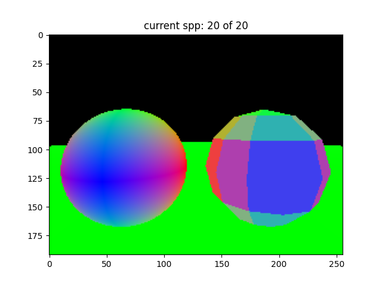
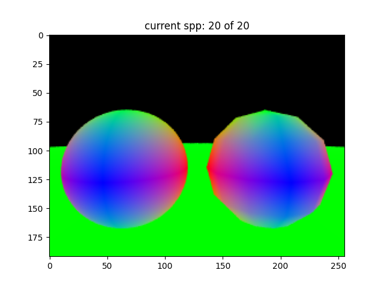
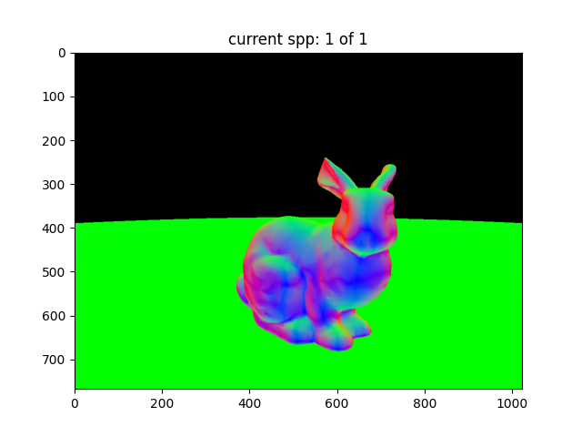
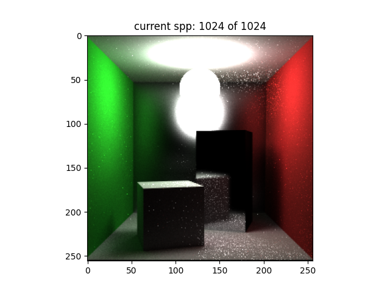
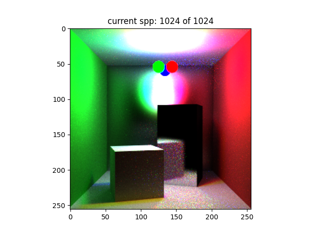
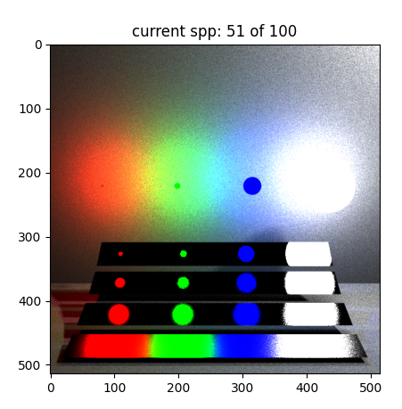
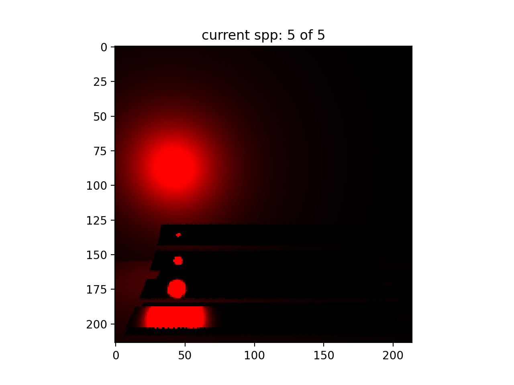

# Rendered Image Showcase [WORK IN PROGRESS]

Welcome to the Rendered Image Showcase, where I display a variety of computer-generated images that demonstrate different rendering techniques and sampling processes.

## Phong interpolation and anti-aliasing
While implementing a progressive renderer, I noticed that the image quality was poor due to aliasing. The "jaggies" artifact on the outline of the sphere. This appearance stems from ray tracing through the center of each square pixel. This happens if the geometry details of the scene are smaller than the size of a single pixel, or if they change significantly from one pixel to the next, then the pixel grid doesn't have a high enough resolution to accurately capture these details.

To illustrate, I rendered two spheres using 20 samples per pixel. On the left I have an implicit sphere function that is rendered using ray-sphere intersection. On the right ray-triangle intersections. Additionally, each coordinate is mapped to a colour channel. The result are colours that represent the surface normal.

  

*This image renders two spheres using 20 samples per pixel to illustrate the "jaggies" on light and shadow.*

To enhance the visual quality of the rendered scene, I've employed two critical techniques:

- **Anti-aliasing**: Utilizing a *jittered sampling* technique, the algorithm randomly samples within each pixel's area. This randomness, achieved by uniformly picking a location within the pixel, helps to smooth out the 'jaggies' and produces a more refined image.

- **Phong Interpolation**: By taking a weighted average of the surface normals at the vertices of a triangle, the algorithm computes a precise surface normal at the intersection point. This interpolation uses *barycentric coordinates* to blend the normals, resulting in more realistic shading across the surface.

  

*Notice the disappearance of jaggies on the right sphere and much better highlight due to phong shading*

## Stanford Bunny

Using the same techniques described above we can apply it to the Standford Bunny model. The result is a much more refined image with smooth shading and no jaggies.

  

*The Stanford Bunny is a common 3D test model.*

## Glossy Surface Rendering with 3 Bounces - Cornell Box

  

*This image showcases a glossy surface with precise light reflection. It uses 1024 samples per pixel (spp) to achieve a high level of detail.*

## 3 Light Source Glossy Surface Rendering with 4 Bounces - Cornell Box

  

*This image showcases a glossy surface with precise light reflection. It uses 1024 samples per pixel (spp) to achieve a high level of detail.*

## Multiple Importance Sampling

  

*Utilizing 50 samples per pixel, this image demonstrates the multiple importance sampling technique to balance different types of light paths.*

## Low Sample Light Rendering

  

*With just 5 samples per pixel, this image exhibits how low sample counts affect the visibility and clarity of light sources.*

## Next Steps
- GPU acceleration using CuPy
---

Sources:

B. W. J. V. K. Liu H, Christiansen T, “Biolemmatizer: a lemmatization tool for morphological
processing of biomedical text,” Journal of Biomedical Semantics, Apr 2012.

