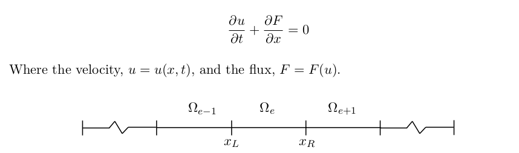
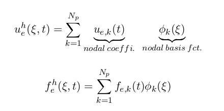
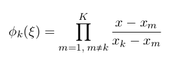
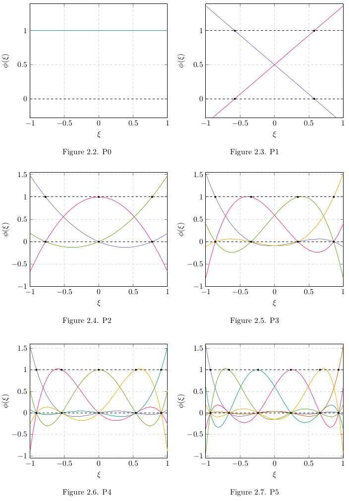
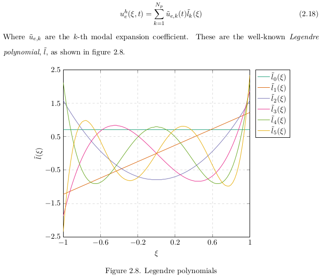

## <i>Introduction</i>
Named after Joseph-Louis Lagrange, the uses of Lagrange polynomials can be found in numerical integration, in cryptography, and also in fluid solvers - Discontinuous Galerkin method (DGM). The DGM is considered to be a type of Finite-element method (FEM), these solvers have the particularity of being conservative to their Finite-volume counterpart. 

<br />

<div align="center">
  
</div>

<br />

The computation domaine on the above figure shows how each element is non-overlapping. Within each element, a number of Lagrange polynomials resides to represent all the solution space.

<br />

<div align="center">
  
</div>

<div align="center">
  
</div>

<br />

## <i>MATLAB & PGF Plots (LATEX)</i>
Using symbolic variables on MATLAB, one can easily find the appropriate equation:

```js
prompt = 'How many nodes would you like? ';
n_x = input(prompt);
syms x

node_pt = [-0.90618, -0.538469, 0, 0.538469 , 0.90618]; nber_pts_plot = 100;
xaxis = linspace(-1,1,nber_pts_plot); %used to plot nodal  basis functions.
files = ["P4_1.txt", "P4_2.txt", "P4_3.txt", "P4_4.txt", "P4_5.txt"];

figure('Name','Lagrange-Polynomials','units','normalized','outerposition',[0 0 1 1]);
hold on;
title('Nodal Basis Functions','FontSize',22,'interpreter','latex');
xlabel('x-position','FontSize',17,'interpreter','latex');
ylabel('y-position','FontSize',17,'interpreter','latex');
for j = 1 : n_x
    B = []; %L = zeros(sym[]);
for i = 1 : n_x
     %Product sum condition. The "skip" will leave a zero which will be
     %removed at line 43.
     if i == j
         continue
     end
     %Fills up the vector by one row at a time.
     %Each row corresponding to the lagrange polynomial of each node.
         L(j,i) = (x - node_pt(i))/(node_pt(j) - node_pt(i));
end
%Filter out the 0 element that was skipped due to i == j.
 B  = nonzeros (L(j,:));
%Product summation.
 C  = prod (B);
%Show each nodal basis function for each Lagrange
 D  = expand (C);
 All(j) = D;
         l = double(subs(D,xaxis))
         files(j)
         fileID = fopen(files(j),'w');
         for axis = 1:nber_pts_plot
            fprintf(fileID,'%f %f \n', xaxis(axis), l(axis));
         end
         fclose(fileID);
         txt = ['Lagrangian polynomial at node ', num2str(j)];
         lgd = plot(xaxis, l, 'DisplayName', txt,'LineWidth',2);
         set(gca,'fontsize',20);
end
%% Plot to verify if the total sum Lagrangian polynomial is equal to one.
All_sum = sum(All);
l2 = double(subs(All_sum,xaxis));
plot(xaxis, l2);
```

The code is convenient enough to also provides with the user a txt file for each polynomial function a database to generate a figure using PGF plots Latex.

<br />

<div align="center">
  
</div>

<br />

Finally, another useful properties in DGM is the Weighted Residual method which consist of taking 2 orthogonal polynomial to reduce numerical errors. These are known as the Legendre polynomials - not to be confused with Lagrange ;).

<br />

<div align="center">
  
</div>

<br />

If you want to know how to generate figures using PGF plots you can use the ton of ressources online at your disposition or you can contact me using jiebao995@gmail.com.

