## <i>Introduction</i>
The ubiquitous nature of turbulence is all around us. It influences many aspect of our every daily life. The air flowing in and out of our lungs is turbulent, as is the invisible air in the room in which you sit. Turbulent boundary layers dictate the vehicle performance whether it's in the air or on the ground. Even the Earth's outer core of molten iron is turbulent, and it is this chaotic behaviour which maintains the terrestrial magnetic field against solar flares.

Needless to say, to hold a predictive model of turbulence would be paramount for the next step in human evolution. 

Our closest attempt to "<i>cage the beast</i>" is the direct numerical simulation (DNS). In theory, these type of simulations mimic the flow field down to the smallest eddy. However, they are tremendously expansive computational wise. Its greediness grow with the Reynolds number, assuming computing rate of 1 gigaflop the time in days is (Pope, 2000): 

<br />

<div align="center">
  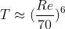
</div>

<br />

Currently, the Reynolds-averaged Navier-Stokes (RANS) equations are the most popular models
for simulating turbulence. Performing RANS simulation requires additional closure for the anisotropic
Reynolds stress tensor. Traditional approaches to the Reynolds stress closure are partially reliable
predictions. This is due to the elusive anisotropic nature of the eddy viscosity. In this project, data-driven turbulence models for the turbulent kinetic energy's production and dissipation terms have been developed to improve RANS accuracy. This model focuses on the turbulent channel case and the NACA 0012. Using limited training data a predictive 99% R2 score has been achieved.

## <i>Canonical Channel Case, Re=180 DNS</i>

<b> <i> The simulation was possible using the GPU cluster of Compute Canada and Calcul Quebec. </i> </b>

  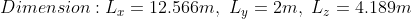
<br />
  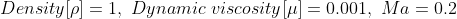


<div align="center">
  
</div>


The simulation showcased above is a direct numerical simulation (DNS) of the canonical wall bounded turbulent channel case. In which the whole spatial and temporal spectrum are solved for accurate turbulence prediction. The showcased simulation is from the dimensionless shear Reynolds of 180. The bulk Reynolds is found using the relationship from [Dean(1978)](https://ui.adsabs.harvard.edu/abs/1974STIN...7522638D/abstract).

<div align="center">
  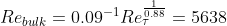
</div>

<br />

The flow field starts laminar and will transition into turbulent regime. However, this transition process can be very slow. Therefore, we can accelerate the transition by adding perturbation in the initial condition:

<div align="center">
  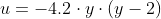
</div>

<br />

<div align="center">
  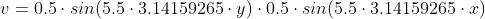
</div>

<br />

<div align="center">
  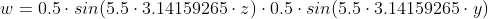
</div>


### Production and Dissipation
<div align="center">
  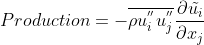
</div>

<br />

<div align="center">
  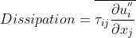
</div>


<br />

Another important disctinction is the compressibility of the fluid. We know for higher Mach numbers, the flow field's density will start to fluctuate. Although, it is not the case here. The Favre averaging is applied for future application with compressible flows. To see how the derivation is applied visit this [page](https://jiebao.ca/essays/Amid-Organized-Chaos.html) and the source can be found on official <a href="https://www.sto.nato.int/publications/AGARD/Forms/AllItems.aspx?RootFolder=%2Fpublications%2FAGARD%2FAGARD%2DR%2D819&FolderCTID=0x0120D5200078F9E87043356C409A0D30823AFA16F60B00B8BCE98BB37EB24A8258823D6B11F157&View=%7B7E9C814C-056A-4D31-8392-7C6752B2AF2B%7D
">AGARD-R-819 </a>.

## Turbulence Modeling with Tensorflow

### Data Pre-processing

The dataset consists of 56 features, 1 continuous output, and 32 325 instances. All features are complete with no missing values. Notice the high number of features. To filter out the unecessary features, we must remember the end goal of the machine learning approach; to improve the RANS solver. This means we are limited to the same input. In other words, the dataset (production and dissipation) are extracted from the DNS of the Turbulent Channel. As such, the Reynolds stress is known but not in the RANS in framework. The plot below is an implementation of the Relief algorithm for regression problem with all the features that would be available.

<div align="center"  ><b> RReliefF Feature Importance</b></div>

<div align="center">
  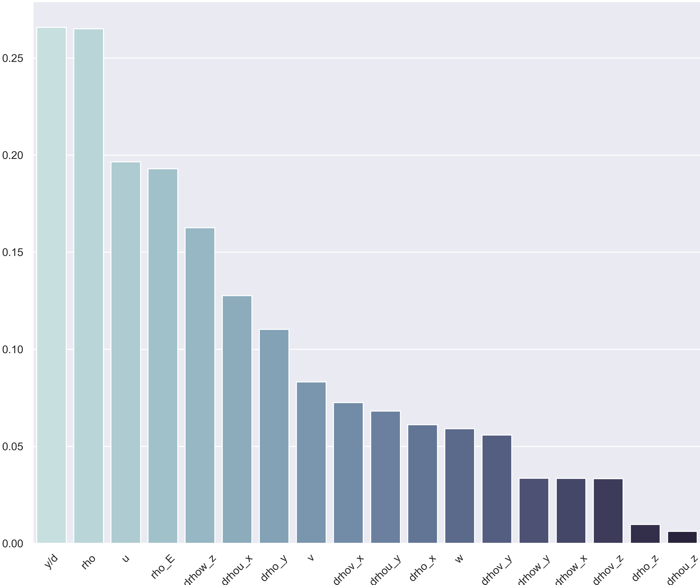
</div>

<br />

Another aspect is from the mechanics of turbulence. A corollary is that the cross-correlation vanishes inside the unstrained turbulence. In the turbulence channel case, this corresponds to the region in the center of the channel. Albeit with a certain lag. Thus, it was decided to remove those features. 
 
<div align="center">
  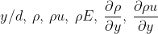
</div>

<br />

Once the features are determined, feature scaling is performed. Data transformation by [standardization ](https://arxiv.org/abs/1502.03167) is applied since it has been shown to speed up convergence via gradient descent and implicitly balances the contribution of all features. Standardization is also required for proper L2 regularization.

```js
def get_data_validation(self, test: bool = False) -> Tuple[pd.DataFrame, pd.DataFrame]:
    """
    Similar to get_data(), this function will take the non-shuffled data instead.
    """
    df_x = self.X_test if test else self.X_train
    df_y = self.y_test if test else self.y_train
    return df_x.copy(deep=True), df_y.copy(deep=True)

def _set_standardize_values_validation(self, test):
    # we do not standardize the test labels
    df = self.get_data_validation(test)[0]
    self.means = df.mean()
    self.stds = df.std()
    df = (df - self.means) / self.stds
    return df
```
As mentionned previously about the vanishing auto-correlation values in the center region of the channel. To ease the process, the model will learn from y/d = 0 to y/d = 0.8. 
### MLP Architecture

For each case, we randomly split the training data into 80% training and 20% validation data. The loss function used is the mean squared error (MSE) between the predicted production and the DNS value. The Adam optimization ([Kingma, D. P. et al., 2014](https://arxiv.org/abs/1412.6980)) is used with an inital learning rate of 10^-6 and a batch size of 10. The weights of the networks were initialized with He uniform ([He, K., et al., 2015](https://www.google.com/url?sa=t&rct=j&q=&esrc=s&source=web&cd=&cad=rja&uact=8&ved=2ahUKEwits8eqhafuAhUHEFkFHXHOAMoQFjAAegQIBRAC&url=https%3A%2F%2Farxiv.org%2Fpdf%2F1604.04112&usg=AOvVaw1ptgdqZeST3Jb2TylAgX_i)) and biases were initialized as zeros. To prevent over-fitting our model, a regularization callback is imposed on the loss function and batch normalization is implemented to accelerate the training.


<div align="center">
  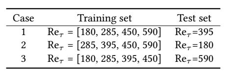
</div>

<br />

The training stops when both the validation loss starts to rise and the patience argument is invoked. In machine learning, the increase of validation loss is a strong indicator for over-fitting ([Goodfellow, I., et al., 2016](https://www.deeplearningbook.org/)). Other model's epoch ranged between 3000-7000. The figure below shows an example of training and validation loss as a function of epochs during a training of 100-Neurons-MLP for case 1.

<div align="center" >
  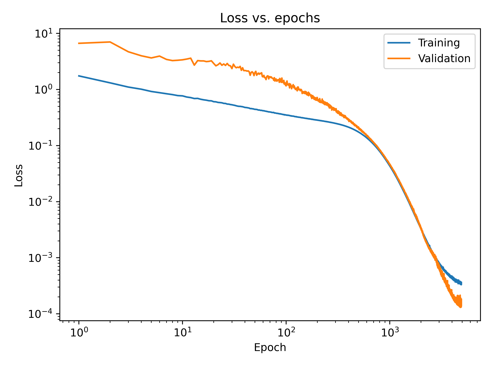
</div>

<br />

The R2 score is a statistical measure that determines how well a regression prediction approximates the true data points. An R2 of 1 indicates a perfect fit. Comparing accross the three cases from the table below, we notice Case 1 has considerably better accuracy. One explanation for this is that Case 2 & 3 prediction zone is outside of the training range. Furthermore, the reason Case 3 has the worst outcome might stem from the fact the training dataset yields low-Reynolds number effect ([Moser,K. et al., 1999](:16
https://cfd.spbstu.ru/agarbaruk/doc/1999_Moser-Kim-Mansour_Direct-numerical-simulation-of-turbulent-channel-flow-up-to-Re-590.pdf)). Thus, a solution would be to include training data of higher Reynolds to balance the effect of low and high Reynolds number.

<br />

<div align="center">
  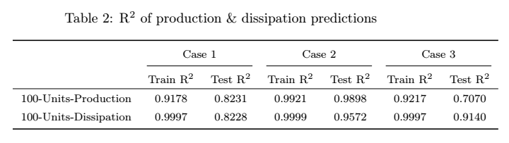
</div>

<br />

At the time of writing this, more physics based solution are being tested. Such as replacing a layer's bias to the corresponding shear Reynolds Number of the training instance. Add more physics based features such as the wall shear velocity. <b> The intuition is to give the machine learning training a higher-level of understanding. </b> 

<i> <b> Work in progress </b> </i>

You can see the Python code on my<a href="https://github.com/DiscoBroccoli/Turbulent-Modelling-using-Machine-Learning-Techniques"><i class="large github icon"></i>Github repo </a>(soon to come...).


<div align="center">
  
</div>

Sources:

* S. Ioffe and C. Szegedy, “Batch normalization: Accelerating deep network training by reducing
internal covariate shift,” 2015.

<br />

* Kingma, Diederik P. and Jimmy Ba. “Adam: A Method for Stochastic Optimization.” CoRR abs/1412.6980 (2015): n. pag.

<br />

* He, K., Zhang, X., Ren, S. and Sun, J. (2015). Delving deep into rectiers: Surpassing human-level performance
on imagenet classication. In Proceedings of the IEEE international conference on computer vision, pp. 1026{1034.

<br />

* Goodfellow, I., Bengio, Y., Courville, A. and Bengio, Y. (2016). Deep learning, vol. 1. MIT press Cambridge.

<br />

* Moser, Robert & Kim, John & Mansour, Nagi. (1999). Direct Numerical Simulation of Turbulent Channel Flow up to Re??=590. Physics of Fluids - PHYS FLUIDS. 11. 943-945. 10.1063/1.869966.


