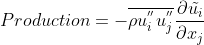

## Introduction soon to come...

  

To view the result on the other dataset I welcome you to visit my <a href="https://github.com/DiscoBroccoli/Turbulent-Modelling-using-Machine-Learning-Techniques"><i class="large github icon"></i>Github repo</a>.

You can learn more at [AGARD-R-819](https://www.sto.nato.int/publications/AGARD/Forms/AllItems.aspx?RootFolder=%2Fpublications%2FAGARD%2FAGARD%2DR%2D819&FolderCTID=0x0120D5200078F9E87043356C409A0D30823AFA16F60B00B8BCE98BB37EB24A8258823D6B11F157&View=%7B7E9C814C-056A-4D31-8392-7C6752B2AF2B%7D).

