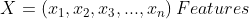
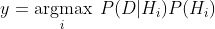
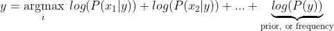
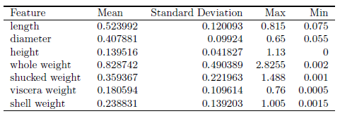
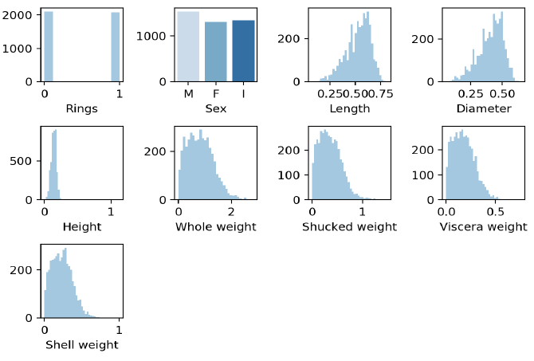
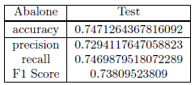
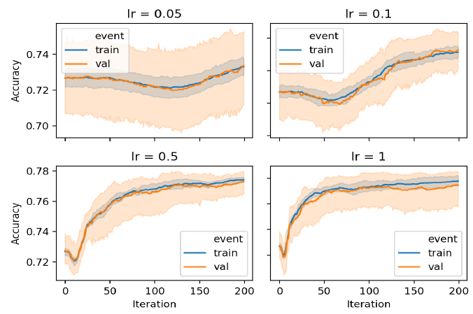

The title summarizes well the subject of this project. Implementation from scratch is the best way to truly understand a model (although intimidating initially). The project helped me learn how to apply data pre-processing and improve my Python programming skills.

To showcase my work, I decided to present the prediction of the age of abalone being older than 9 years old or not given a set of physical
measurements is a valuable task for both farmers and customers. To determine the price of
the shellfish, farmers estimate the abalone’s age by cutting the shells and counting the rings
through the microscope, a very complex and costly method due to the variation in their size
and growth characteristics. This study <a href="https://www.researchgate.net/publication/337146276_Machine_Learning_Project_-_Predict_the_Age_of_Abalone">[Y. Han, 2019]</a> shows the analysis of multiples classifiers used to
predict the abalone age, including Gaussian Naive Bayes.

## Naive Bayes Classifier
We will first start with naive Bayes classifier (NBC). Recall, if the features are mutually-independent. Then NBC estimates the prior probabilities of each hypothesis and the probability of each instance. 

<p align="center">
	
</p>

<p align="center">
	
</p>

Notice, the product can lead to numbers approaching 0 which will cause underflow. The latter term refers to the 
event when a floating-point data runs out of precision due to extremely tiny numbers. The common work around is to use log-probabilities. 
<p align="center">
	
</p>

We now observe the simple task left ahead. Build the necessary framwork to evaluate the max posterior and the classifier will have accomplished its role.

```js
        # Prob of binary categorical number of occurences/total
        for col in cat.columns:
            unique = cat[col].value_counts()
            unique = unique.apply(lambda x: x/class_count)
            self.likelihoods[s][col] = unique

        # Prob of binary
        for col in bin.columns:
            unique = bin[col].value_counts()
            unique = unique.apply(lambda x: x / class_count)
            self.likelihoods[s][col] = unique

        self.priors[s] = class_count / float(num_samples)
```

```js
    def max_posterior(self, [...]):
        posteriors = []
        # probability for each class
        for i in self._classes:
            prior = np.log(self.priors[i])
            # sum of all the n feature probabilities
            cont_likelihood = np.log(self.normal(i, cont))
            cont_likelihood = np.sum(cont_likelihood[~np.isnan(cont_likelihood)])
            cat_likelihood = np.sum(np.log(self.categorical_likelihood(i, cat)))
            bin_likelihood = np.sum(np.log(self.categorical_likelihood(i, bin)))
            likelihood = cont_likelihood + cat_likelihood + bin_likelihood
            posterior = prior + likelihood
            # posteriors contain the probabilities of the two labels for each instance
            posteriors.append(posterior)

        return self._classes[np.argmax(posteriors)]
```


## Data Preprocessing
Data transformation by standardization is applied since it has been shown to speed up convergence
via gradient descent <a href="https://arxiv.org/abs/1502.03167">[ S. Ioffe and C. Szegedy, 2015]</a> and implicitly balances the contribution of all features. The shellfish abalone rings label with values ranging from 4 to 22 years old was binarized into 1 for all values 9 years old and younger and 0 for all values older than 9 years old. Standardization is also required for proper L2 regularization model. Thus, the data set is the outcome of data cleaning, relevance analysis, data transformation and data reduction.

<p align="center">
	
</p>

<p align="center">
 
</p>

## Results
After hyperparameter tuning, Naive Bayes is trained on the entire train split and tested on
the unseen test split for all data sets. The model was first validated using 5 fold cross validation; then trained on the train split and evaluated on the test split.

<p align="center">
 
</p>

<p align="center">
 
</p>


To view the result on the other dataset I welcome you to visit my <a href="https://github.com/DiscoBroccoli/logistic-regression-and-naive-Bayes-from-Scratch"><i class="large github icon"></i>Github repo</a>.

# Sources
S. Ioffe and C. Szegedy, “Batch normalization: Accelerating deep network training by reducing
internal covariate shift,” 2015.

Y. Han, Machine Learning Project - Predict the Age of Abalone. PhD thesis, 06 2019.


