This repo contains a few fun examples of computational fluid dynamics and their code written by Jie on MATLAB.
* Isentropic Vortex
* 2D Incompressible Cylinder
* Multidimensional Diffusion
* Lid-Driven Square Cavity Flow
 
## Isentropic Vortex - 2D Euler Solver

The simulation marches in time in a periodic domain of length Lx = Ly = 20. The Euler Solver makes use of the 2nd central finite difference scheme in space and the 4th Runge-Kutta method in time. The final time is t =20. The Euler set of fluid equation are quasilinear hyperbolic equations, it governs the adiabatic and inviscid flow. The distinction between the Euler set and the infamous Navier-Stokes equations is the neglection of the viscosity within the fluid. This is an important assumptions once one wants to study the drag effect.

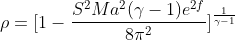

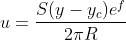

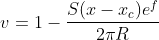

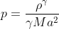

The current vortex strength is set to R = 1.5, Mach number is 0.4 and the characteristic radius gamma is 1.4. For more information you can consult [here](https://www.researchgate.net/publication/299645119_A_Survey_of_the_Isentropic_Euler_Vortex_Problem_using_High-Order_Methods).

The conserved variable are stored as follows:

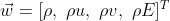

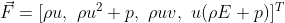

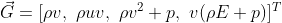

Once the field has been initialized, we can start marching the solution in time (RK4,4) with a central scheme.

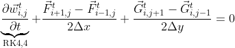

source: [Spiegel, Seth & Huynh, H.T. & DeBonis, James. (2015). A Survey of the Isentropic Euler Vortex Problem using High-Order Methods. 10.2514/6.2015-2444. ]

## 2D Incompressible Cylinder
The solver used is the Python based PyFR, which is a FEM method using the [Discontinuous Galerkin Method](https://www.researchgate.net/publication/309715679_A_Flux_Reconstruction_Approach_to_High-Order_Schemes_Including_Discontinuous_Galerkin_Methods).

The implementation uses a time-step and pseudo time-step of size 1.25e-2 & 2.5e-3 respectively. For the complete configuration you can visit the folder [2D Incompressible Cylinder](https://github.com/DiscoBroccoli/CFD-Simulation/tree/main/2D%20Incompressible%20Cylinder). As well as the official website, [PyFR](http://www.pyfr.org/index.php).

source: [Huynh, H.T.. (2007). A Flux Reconstruction Approach to High-Order Schemes Including Discontinuous Galerkin Methods. AIAA Paper AIAA 20074079. 1-42. ]

## Multidimensional Diffusion Equation

The heat distribution in a solid body obeys the heat equation:

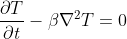

Where the beta is the heat diffusivity. The Courant–Friedrichs–Lewy (CFL) used in this simulation is 0.25. The CFL is a stability criterion in order to reach convergence in hyperbolic PDEs.

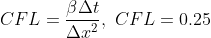

## Lid-Driven Cavity Flow - 2D Navier-Stokes Solver

The square lid-driven cavityis a widely used canonical simulation to validate numerical methods. The simulation works as the following, it has no-slip condition on each wall except the lid. Which has a constant velocity component, as shown on the schematic.

The numerical method did not change but now we need to take into the viscous effect into consideration. In essence, this will result in a intermediate computation for each time step. Furthermore, the Reynolds Number for this simulation has been calibrated to 100.

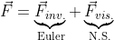

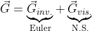

The inviscid part is the contribution from Euler equations, refer to the Isotropic Vortex section. The viscous effect fluxes are:

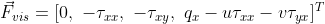

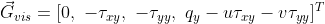

The new term are the heat flux and shearing stresses.

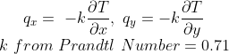

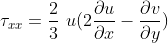

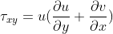

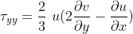

Similarly to before, for every derivative we use the central scheme to approximate it. The final result:

To validate, the result have been compared with values from Ghia[2009].

source: [Marchi, Carlos & Suero, Roberta & Araki, Luciano. (2009). The Lid-Driven Square Cavity Flow: Numerical Solution with a 1024 x 1024 Grid. Journal of The Brazilian Society of Mechanical Sciences and Engineering - J BRAZ SOC MECH SCI ENG. 31. 10.1590/S1678-58782009000300004. ]

###  If you have any general inquiries feel free to reach me, [jiebao995@gmail.com](jiebao995@gmail.com).
