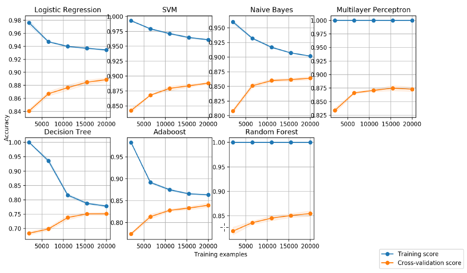
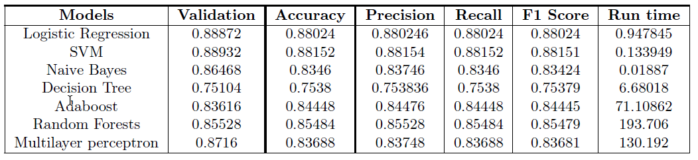
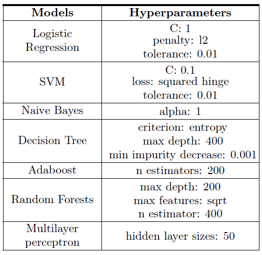

This study presents a comparison between supervised learning algorithms to classify textual data with a focus on the performance of seven classifiers, namely Logistic Regression, Decision Trees, Support Vector Machines (SVM), AdaBoost, Random Forests, Naive Bayes and Multilayer Perceptrons (MLP). Each model was trained to predict categorical labels on the IMDB Reviews data set [Maas, 2011] for binary classification. After hyperparameter optimization with 5-fold cross-validation and Grid Search, MLP and SVM achieved the highest test accuracy of 88.15% for the IMDB Reviews dataset.

## Data Pre-processing
The large movie review dataset consists of 50,000 highly polar reviews from the IMDB website,
classified as half positive and half negative, with a 50% training and testing split. Each entry
is a single-lined text file containing a raw review. The preprocessing of the reviews consisted of
lower-casing the raw text and removing break tags so that the texts can be tokenized to create the
feature vectors.

```js
def clean_review(review):   
	replacements = {
		'<br />': ' '
		}
	regexp = re.compile('|'.join(map(re.escape, replacements)))    
	return regexp.sub(lambda match: replacements[match.group(0)], review)

```
### Bag of Words & TF-IDF
Because the algorithms cannot interpret text data directly, the Bag of Words technique was applied
to extract features for use in the models. Each text document is represented by a fixed-length
numerical vector by counting the frequency of each word. By applying Term Frequency-Inverse
Document Frequency (TF-IDF), using TfidfVectorizer from SciKit-Learn, to find the most suitable
features to describe each category. It measures the importance of each word to a document relative
to a collection of documents by comparing the word frequency in a document with the specificity
of the term (i.e. inversely proportional to its frequency in all documents). With respect to the
specificity, limitating the maximum document frequency of each word to 25% of the documents.
This filters out common words that do not provide information on the class labels.

### Tokenization: Stop words, Lemmatization & N-Grams

For the tokenization process, the features are cleaned and extracted from the input data set by removing
the stop words, i.e. commonly used words in the English language. Examples of stop words include
"and", "the" and "is". Similarly, many English words appeared in the data set in inflected forms.
Therefore, two words may be written in different ways to express the same meaning. To mitigate
the issue, lemmatization technique is used, from  <a href="https://spacy.io/">[spaCy]</a>, which performs a dictionary
lookup to remove the inflectional endings. Lemmatizaion is a popular technique in NLP and a
team of researchers applied this technique to process biomedical text <a href="https://www.ncbi.nlm.nih.gov/pmc/articles/PMC3359276/">[Liu H. et al., 2012]</a>. Finally, tokenizing with n-grams, a sequence of n adjacent words, to consider the context pertaining to words.
More specifically, tokenizing with bigrams to extract a sequence of words as a feature.

```js
if lemma:
  vectorizer = TfidfVectorizer(tokenizer=LemmaTokenizer(), strip_accents="unicode", lowercase=True,
               stop_words=['english'], max_features=20000, max_df=0.25)
elif bigram:
  vectorizer = TfidfVectorizer(strip_accents="unicode", lowercase=True, stop_words=['english'],
               max_features=20000, max_df=0.25, token_pattern=r'(?u)\b[A-Za-z]\w+\b',
               ngram_range=(1, 2))
else:
  vectorizer = TfidfVectorizer(strip_accents="unicode", lowercase=True, stop_words=['english'],
               max_features=20000, max_df=0.25, token_pattern=r'(?u)\b[A-Za-z]\w+\b')
```

## Results

The SVM has the highest validation accuracy of 88.9% for the IMDB Reviews dataset. When looking at the test precision, recall and F1 scores, the SVM is the overall best performing model for the IMDB Reviews dataset.
<p align="center">
 
</p>

The preprocessing work of mapping the textual input data into efficient real valued vector
is a vital step in any text classification problem. One attempt was to introduce lemmatization
and bigrams during the tokenization process. Another attempt was conducted using part-ofspeech
tagger (POS), where for each input a chunking function was parsed. Mainly, we decided
to extract nouns with their descriptive counterparts, such as verbs and adverbs.

<p align="center">
 
</p>

Both methods did not improve the models in practice, most likely due to information loss. Namely, we noticed
the vocabularies between some categories are sometimes familiar and not distinct enough, so by
extracting only these parts, we lose some of the inherent relationships between words.
<p align="center">
 
</p>


Sources:

B. W. J. V. K. Liu H, Christiansen T, “Biolemmatizer: a lemmatization tool for morphological
processing of biomedical text,” Journal of Biomedical Semantics, Apr 2012.
