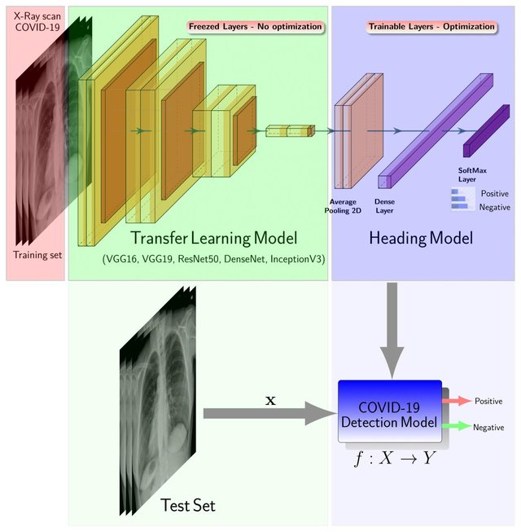
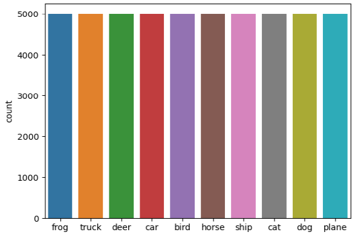
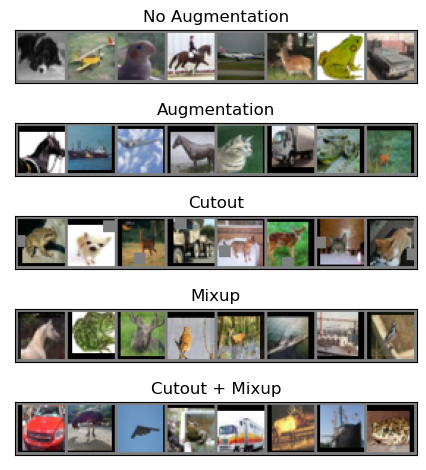
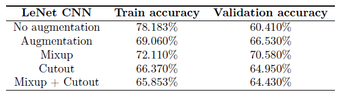
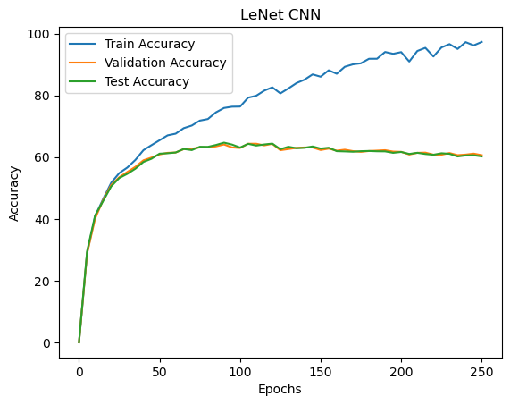
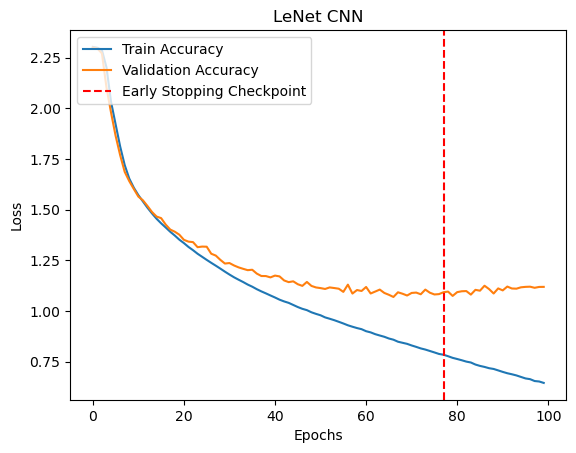
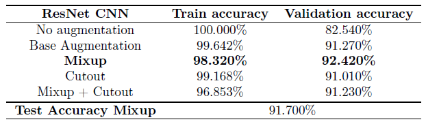

A popular field for machine learning is that of Computer Vision. From image classification to image segmentation and object recognition, neural networks are very effective in learning, identifying high level concepts and modelling these functions. More recently, chest X-rays are playing an important role in the testing and diagnosis of COVID-19 disease. Researchers are implementing transfer learning pipeline for distinguishing inflammation in lungs due to COVID-19 and Pneumonia with no infection [Zebin T. et al., 2020](https://link.springer.com/article/10.1007/s10489-020-01867-1). 

In this project, a Convolutional Neural Networks (CNNs) is trained on the CIFAR-10 dataset for image classification of
simple image data. In the experiments, I analyzed the accuracies of the train, validation and test
split as a function of training epochs for LeNet CNN. I noticed
that CNNs are significantly better at the image classification task, being able to fit strongly to
the training data while maintaining good generalization performance. Finally, I performed comparisons between LeNet and ResNet
architectures and on the effects of data augmentation as a regularization technique, achieving a final
validation accuracy of 92.42 % and test accuracy of 91.7% with ResNet and Mixup augmentation.

## CIFAR-10
The CIFAR-10 dataset contains 60 000 tiny colour images down-scaled to 3232 pixels, each
labelled with one of the following 10 mutually exclusive classes: airplanes, cars, birds, cats, deer,
dogs, frogs, horses, ships, and trucks [A. Krizhevsky, 2009.](https://www.cs.toronto.edu/~kriz/learning-features-2009-TR.pdf). The dataset split consists of 50 000 training images
and 10 000 test images, loaded using the PyTorch DataLoader. A further split is made of
the training set into 40 000 training images and 10 000 images for validation of our models. The
distribution of the original training set is uniformly distributed across the 10 classes, with 5000
images for each class as shown in the figure on the right.

<p align="center">
 
</p>

As an experiments, I decided to test the effects of various data augmentation techniques
of the training set as a method of regularization. Due to the large number of parameters in
Deep Learning models, they can easily overfit to the training data, and so an attempt to reduce
the generalization error by augmenting the data. The first method of augmentation consists of
randomly cropping sides of the images and randomly flipping images horizontally. Throughout
the paper, these modifications form the base augmentation and the other modifications
are applied on top of these augmentations. The second method, called Cutout, involves randomly
removing square regions in the images, in an attempt to increase the importance of small features
in the image rather than relying only on large features [T. DeVries et al., 2017](https://arxiv.org/pdf/1708.04552.pdf). The third method Mixup, involves the
linear combination of images to attempt to model relationships across different classes [H. Zhang et al., 2017](https://arxiv.org/abs/1710.09412). For
example, a mixup image can be 25% of a dog and 75% of a cat and allows the model to recognize
this split. Finally, a combination of Mixup and Cutout is also tested. Sample images after each
transformation are shown the figure below.

<p align="center">
 
</p>

```js
# Image transformations using torch
# Check if we want data augmentation, if yes, we add random flips and crops to the image
# This should help the model to generalize better

transformations = []
if configurations.model[conf]["data_augmentation"]:
    transformations.append(transforms.RandomCrop(32, padding=4))
    transformations.append(transforms.RandomHorizontalFlip())

# ToTensor converts the PILImage into a Torch tensor, the PIlImage has dimensions Height x Width x Channels, tensor has dimensions Channels x Height x Width
# Normalize "standardizes" the input, centering the distribution at 0 with std dev 1. Here it converts ranges [0,1] to [-1,1]
transformations.append(transforms.ToTensor())
transformations.append(transforms.Normalize((0.5, 0.5, 0.5), (0.5, 0.5, 0.5)))

if configurations.model[conf]["cutout"]:
    transformations.append(utils.Cutout(n_holes=1, length=8))
transform = transforms.Compose(transformations)

```
### LeNet
The LeNet architecture is one of the earliest CNNs, proposed by [Yann LeCun et al. in 1998](http://vision.stanford.edu/cs598_spring07/papers/Lecun98.pdf)
and is a simple and small neural network. Originally used for digit recognition of the MNIST
dataset, it was an effective and simple to train neural network with backpropagation. The basic
structure involves two convolutional layers each followed by a ReLU activation function and Max
Pooling. The output is then fed through two fully connected layers, both with a ReLU activation
function and results in 10 outputs.

### ResNet

The deep Residual Network (ResNet) is a relatively new CNN structure that aims to solve a
particular issue with deep neural networks. According to the universal approximation theorem,
a neural network with one hidden layer of finite neurons can approximate any function, however
this layer can be exponentially large. Deeper networks were then popularized but a couple of
issues arose with very deep networks. One major obstacle is the vanishing/exploding gradient
problem from the backpropogation of the gradient, however this issue has been minimized with
normalization and ReLU activation functions. The other issue is that in deep networks, as the
depth increases, the training accuracy reaches a maximum and degrades, resulting in a higher
training errors.
The authors of ResNet propose that the deep networks are difficult to optimize and that they
have troubles approximating identity mappings. Theoretically, in the worst case, addition of more
layers should never produce greater training errors because they can always map to the identity
function, but that does not seem to be the case. Thus, ResNet introduces identity shortcut
connections that skip over convolution layers. The layers fit a residual mapping instead which the
authors hypothesize are easier to optimize [K. He et al., 2015](https://arxiv.org/pdf/1512.03385.pdf). During training, if the added layer does not provide
any meaningful information after ReLU, only the identity mapping is learned. In this experiment, ResNet with 32 layers is used.

### Methodology
The two CNN architectures were implemented using the PyTorch neural network modules.
Each model was trained for 200 epochs using Stochastic gradient descent with minibatch size 128,
learning rate 0.1 from epochs 1 to 100, 0.01 from 100 to 150 and 0.001 from 150 to 200, momentum
0.9 and weight decay 0.0001. The models were evaluated using the validation split every 10 epochs
and the best model checkpoint is saved for comparison.


## Results
Notice that for
both models, all techniques of data augmentation result in higher validation accuracies. Which leads to the conclusion that all these data augmentation techniques suffice as a method of regularization as they
allow the model to generalize better. The training accuracy decreases for both LeNet and ResNet
after data augmentation but validation accuracy increases, indicating the model is generalizing
better and overfitting is reduced.

<p align="center">
 
</p>

Looking closer at the results, applying Mixup after general data augmentation
has the most significant impact on model performance. In the LeNet CNN, Mixup has around a 4%
increase in validation accuracy compared to the next highest (general augmentation). Similarily,
Mixup has a 1% increase for ResNet validation accuracy compared to the next highest. On the
other hand, Cutout does not seem to improve validation accuracies for both LeNet and ResNet,
with it actually being worse than normal augmentation for LeNet. Combining Cutout and Mixup
also does not improve the performance of Cutout alone. From the nature of Mixup, this suggests
that allowing the model to extract information about relationships between classes is beneficial
to its predictive power. Since Mixup combines images of different classes, the model learns the
relative closeness to each class which is more natural for multiclass neural networks.

<p align="center">
 
</p>

<p align="center">
 
</p>

Finally various data augmentation techniques were experimented: base augmentation (horizontal
flips and cropping of edges), Mixup and Cutout on LeNet and ResNet CNN models. We
found that data augmentation is an effective method of improving model generalization and that
Mixup provides the best improvement for the performance of the model. By combining classes
together, Mixup provides information for training the model to be able to recognize relationships
between classes. The ResNet model with Mixup has the highest validation accuracy (Table below) with
92.42% and its final test accuracy was 91.7% on the test split.

<p align="center">
 
</p>

### <b>The complete code can be found on my <a href="https://github.com/DiscoBroccoli/Classification-of-Image-Data"><i class="large github icon"></i>Github repo</a></b>.

Sources:

* A. Krizhevsky, “Learning multiple layers of features from tiny images,” tech. rep., 2009.

<br />
* T. DeVries and G. W. Taylor, “Improved regularization of convolutional neural networks with
cutout,” arXiv preprint arXiv:1708.04552, 2017.

<br />
* Y. N. D. D. L.-P. Hongyi Zhang, Moustapha Cisse, “mixup: Beyond empirical risk minimization,”
International Conference on Learning Representations, 2018.

<br />
* Y. Lecun, L. Bottou, Y. Bengio, and P. Haffner, “Gradient-based learning applied to document
recognition,” Proceedings of the IEEE, vol. 86, pp. 2278 – 2324, 12 1998.

<br />
* K. He, X. Zhang, S. Ren, and J. Sun, “Deep residual learning for image recognition,” CoRR,
vol. abs/1512.03385, 2015.


